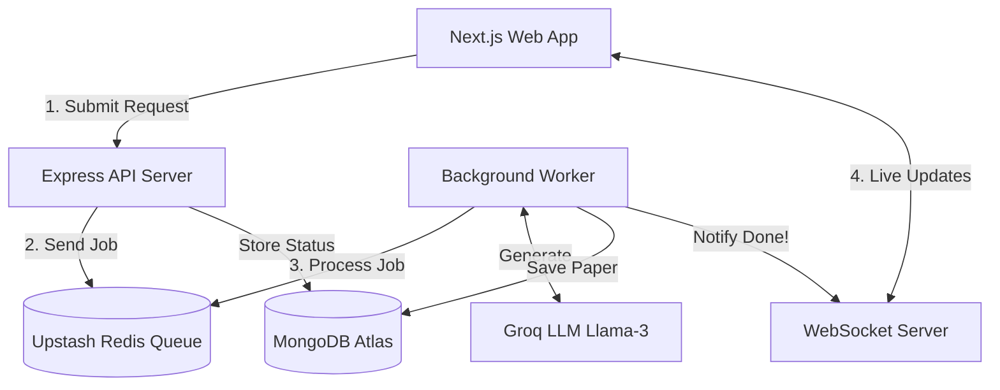

<div align="center">
  
  
  # VedaAI 🎓
  ### The Smart Assessment Platform for Modern Educators
  
  <p align="center">
    <a href="https://veda-ai-eta.vercel.app" target="_blank">
      
    </a>
    
    
    
    
  </p>

  <p><strong>Transforming hours of manual test creation into seconds of AI-powered magic.</strong></p>
</div>

---

## 🌟 What is VedaAI?

Creating high-quality, balanced question papers is one of the most time-consuming tasks for teachers. **VedaAI** is a full-stack platform that solves this problem. 

By simply uploading a curriculum document or specifying a topic, teachers can instantly generate a fully structured question paper—complete with varied difficulty levels, different question types, and a comprehensive answer key. 

## ✨ Key Features

- **🚀 Instant Generation:** Create a complete, curriculum-aligned question paper in under 2 seconds.
- **🧠 Context-Aware AI:** Upload your own class notes or PDF documents to ensure the questions match your specific syllabus.
- **📊 Balanced Difficulty:** Automatically distributes questions across Easy, Medium, and Hard difficulty levels.
- **✅ Auto-Generated Answer Keys:** Every test comes with a hidden answer key that teachers can toggle on and off.
- **🖨️ Print-Ready Exports:** Seamlessly export generated papers into clean, professional PDF documents ready for the classroom.
- **📱 Beautiful Dashboard:** A premium, fully responsive interface built for both desktop and mobile devices.

---

## 🛠️ How It Works (The Technical Magic)

Behind the simple interface is a powerful, decoupled system designed to be fast, reliable, and scalable.

### System Architecture



### 💡 Why I Built It This Way (Engineering Highlights)

When building AI applications, waiting for the AI to finish thinking can cause the app to freeze or timeout. I architected VedaAI to solve these exact problems:

1. **Lightning-Fast AI (Groq + Llama 3):** Standard AI models take up to 30 seconds to write a test. By using Groq's specialized hardware, VedaAI generates the entire test in **under 2 seconds**. The AI is strictly instructed to return clean JSON data, ensuring the app never breaks from badly formatted text.
2. **Never Freezing the App (BullMQ + Redis):** Instead of making the user wait on a loading screen, the Express backend immediately passes the heavy AI task to a **Background Worker**. This means the main server stays fast and responsive for everyone else.
3. **Live Updates without Refreshing (WebSockets):** How does the user know when the test is ready? Instead of the browser constantly asking the server "Is it done yet?" (which wastes data), the server uses **WebSockets** to push a notification to the user the exact millisecond the AI finishes.

---

## 💻 The Tech Stack

| Part of the App | Technologies Used |
| :--- | :--- |
| **Frontend (User Interface)** | Next.js 14, React, TypeScript, Tailwind CSS, Zustand, Clerk Auth |
| **Backend (The Brain)** | Node.js, Express, TypeScript, Multer (File Uploads) |
| **Queues & Real-time** | `ws` (WebSockets), BullMQ, Redis Pub/Sub |
| **Database & AI** | MongoDB Atlas, Mongoose, Groq API (`llama-3.3-70b`) |
| **Hosting & Infrastructure**| Vercel (Frontend), Render (Backend), Upstash (Serverless Redis) |

---

## 🚀 Running the Project Locally

Want to try running the code on your own computer? It's easy! Follow these steps.

### What you need first:
1. **Node.js** installed on your computer.
2. **Docker Desktop** running (to run the Redis database).
3. Free API keys from: [Groq](https://console.groq.com), [MongoDB Atlas](https://www.mongodb.com/atlas), and [Clerk](https://clerk.com).

### Step 1: Download & Install
Open your terminal and run:
```bash
# Clone the code
git clone https://github.com/Aditya060806/VedaAI.git
cd VedaAI

# Install dependencies for both parts of the app
cd frontend && npm install && cd ..
cd backend && npm install && cd ..
```

### Step 2: Add Your Secret Keys
Create two `.env` files to store your keys.

**1. Inside the `backend` folder, create `.env`:**
```env
PORT=4000
MONGODB_URI=your_mongodb_connection_string
REDIS_URL=redis://localhost:6379
GROQ_API_KEY=your_groq_api_key
FRONTEND_URL=http://localhost:3000
```

**2. Inside the `frontend` folder, create `.env.local`:**
```env
NEXT_PUBLIC_API_URL=http://localhost:4000
NEXT_PUBLIC_WS_URL=ws://localhost:4000/ws

# Get these from your Clerk Dashboard
NEXT_PUBLIC_CLERK_PUBLISHABLE_KEY=your_clerk_key
CLERK_SECRET_KEY=your_clerk_secret
NEXT_PUBLIC_CLERK_SIGN_IN_URL=/sign-in
NEXT_PUBLIC_CLERK_SIGN_UP_URL=/sign-up
```

### Step 3: Start the App!
You'll need three separate terminal windows to run the different parts of the system:

**Terminal 1: Start the Database Queue**
```bash
docker-compose up -d
```

**Terminal 2: Start the Backend & AI Worker**
```bash
cd backend
npm run dev
```

**Terminal 3: Start the Website**
```bash
cd frontend
npm run dev
```

Finally, open your browser and go to **http://localhost:3000**. You're ready to create AI tests!

---

## 👨‍💻 About the Author

Built by **Aditya Pandey**.

- **GitHub:** [@Aditya060806](https://github.com/Aditya060806)
- **Live Project:** [veda-ai-eta.vercel.app](https://veda-ai-eta.vercel.app)

> *This project was built as a comprehensive showcase of full-stack engineering, modern system architecture, and practical AI integration.*
