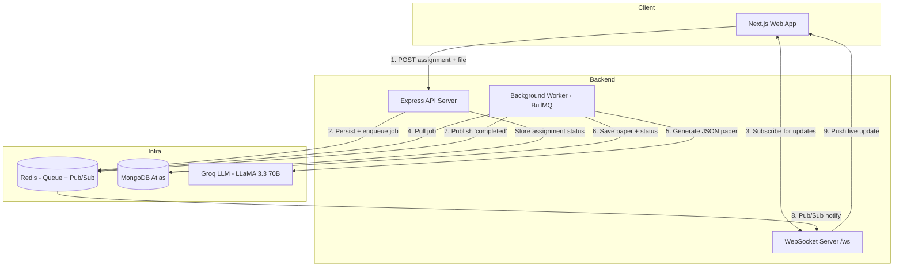

<div align="center">
  

  <h1>VedaAI 🎓</h1>

  <h3>The Smart Assessment Platform for Modern Educators</h3>

  <p><em>Turn hours of manual question-paper creation into seconds of AI-powered generation.</em></p>

  <p align="center">
    <a href="https://veda-ai-eta.vercel.app" target="_blank">
      
    </a>
    <a href="#-getting-started">
      
    </a>
    
  </p>

  <p align="center">
    
    
    
    
    
    
    
    
    
    
  </p>
</div>

---

## 📑 Table of Contents

- [What is VedaAI?](#-what-is-vedaai)
- [Key Features](#-key-features)
- [Tech Stack](#-tech-stack)
- [System Architecture](#-system-architecture)
- [How a Question Paper Gets Generated](#-how-a-question-paper-gets-generated)
- [Project Structure](#-project-structure)
- [Getting Started](#-getting-started)
- [Environment Variables](#-environment-variables)
- [Available Scripts](#-available-scripts)
- [API Reference](#-api-reference)
- [Real-Time WebSocket Protocol](#-real-time-websocket-protocol)
- [Data Models](#-data-models)
- [Deployment](#-deployment)
- [Roadmap](#-roadmap)
- [Contributing](#-contributing)
- [License](#-license)
- [Author](#-author)

---

## 🌟 What is VedaAI?

Creating high-quality, well-balanced question papers is one of the most time-consuming parts of teaching. **VedaAI** removes that friction entirely.

A teacher simply chooses the question types they want (MCQs, short answers, essays, numericals, and more), optionally uploads a syllabus document or class notes, and clicks generate. Within a couple of seconds, VedaAI returns a **fully structured, print-ready question paper** — organized into sections, balanced across difficulty levels, and bundled with a complete answer key.

It is a full-stack, production-shaped application built around an **asynchronous job pipeline** so the interface never freezes while the AI is "thinking," and the teacher gets a **live notification** the moment their paper is ready.

> 🔗 **Try it live:** [veda-ai-eta.vercel.app](https://veda-ai-eta.vercel.app)

---

## ✨ Key Features

| Feature | Description |
| :--- | :--- |
| 🚀 **Instant Generation** | Complete, curriculum-aligned papers generated in seconds using Groq's ultra-fast LLM inference. |
| 🧠 **Context-Aware AI** | Upload a PDF, TXT, or image. The worker feeds your document content into the prompt so questions match your actual syllabus. |
| 🎚️ **Configurable Question Mix** | Choose from 8 question types and set the exact count and marks for each. Totals update live. |
| 📊 **Balanced Difficulty** | Questions are auto-distributed across **Easy / Moderate / Hard** (roughly 40% / 40% / 20%). |
| ✅ **Auto-Generated Answer Keys** | Every paper ships with a hidden answer key teachers can toggle on or off. |
| 🖨️ **Print-Ready Export** | Clean, classroom-ready layout with one-click "Download as PDF" via the browser print pipeline. |
| 🔔 **Live Status Updates** | WebSockets push `pending → processing → completed` updates in real time — no page refreshing. |
| 🔐 **Secure Auth** | User authentication and session management handled by Clerk. |
| ♻️ **One-Click Regenerate** | Not happy with a paper? Regenerate it from the original inputs without re-entering anything. |
| 📱 **Responsive Dashboard** | A premium, mobile-friendly interface with sidebar navigation, library, and an AI toolkit hub. |

---

## 💻 Tech Stack

| Layer | Technologies |
| :--- | :--- |
| **Frontend** | Next.js 14 (App Router), React 18, TypeScript, Tailwind CSS, Zustand (state), TanStack React Query, Clerk (auth), Lucide Icons |
| **Backend API** | Node.js, Express 4, TypeScript, Multer (file uploads), Zod (validation) |
| **Async Processing** | BullMQ (job queue), Redis (broker + Pub/Sub), `ws` (WebSocket server) |
| **Database** | MongoDB Atlas + Mongoose ODM |
| **AI** | Groq SDK running `llama-3.3-70b-versatile` with strict JSON output |
| **Infrastructure** | Vercel (frontend), Render (backend + worker), Upstash (serverless Redis), Docker Compose (local Redis) |

---

## 🏗 System Architecture

VedaAI is intentionally **decoupled**: the API server stays fast and responsive while a separate background worker handles the heavy AI generation. They communicate through Redis, and results are pushed back to the browser over WebSockets.



### 💡 Why It's Built This Way

1. **Fast AI without timeouts (Groq + LLaMA 3.3).** Standard models can take 20–30 seconds to write a full paper, which risks HTTP timeouts and a frozen UI. Groq's inference hardware returns results in seconds, and the model is constrained to emit **clean JSON only** (via `response_format: json_object`) so the app never breaks on malformed text.
2. **Never block the request thread (BullMQ + Redis).** The API immediately persists the assignment, enqueues a job, and responds with a `jobId`. The actual generation runs in a separate worker process with `concurrency: 3` and automatic retries (3 attempts, exponential backoff).
3. **Real-time, not polling (WebSockets + Redis Pub/Sub).** Because the worker is a separate process from the API, it publishes completion events to a Redis channel (`ws:notify`). The API's WebSocket server subscribes to that channel and relays updates to exactly the clients watching that assignment.

---

## 🔄 How a Question Paper Gets Generated

1. **Teacher submits** the create form (`/assignments/create`) — question types, counts, marks, optional file, and instructions.
2. **API validates** the payload with Zod, stores the `Assignment` in MongoDB with status `pending`, and **enqueues a BullMQ job**.
3. **Frontend subscribes** to the assignment's `assignmentId` over WebSocket and navigates to the detail page.
4. **Worker picks up the job**, sets status to `processing`, and (for `.txt` uploads) reads up to 4,000 characters of document content to enrich the prompt.
5. **Groq generates** a structured JSON paper (sections, questions, difficulty, marks, and answer key).
6. **Worker saves** the `QuestionPaper`, marks the assignment `completed`, and **publishes** a notification.
7. **WebSocket pushes** the `completed` event to the browser, which fetches and renders the finished, print-ready paper.

---

## 📁 Project Structure

```
vedaai/
├── docker-compose.yml          # Local Redis service
│
├── backend/                    # Express API + BullMQ worker
│   ├── src/
│   │   ├── index.ts            # API server entry (Express + HTTP + WS bootstrap)
│   │   ├── worker.ts           # BullMQ worker — AI generation pipeline
│   │   ├── lib/
│   │   │   ├── ai.ts           # Groq client + prompt builder + JSON parsing
│   │   │   ├── queue.ts        # BullMQ queue + Redis connection config
│   │   │   └── websocket.ts    # WS server + Redis Pub/Sub bridge
│   │   ├── models/
│   │   │   └── index.ts        # Mongoose schemas: Assignment, QuestionPaper
│   │   └── routes/
│   │       └── assignments.ts  # REST endpoints (CRUD + regenerate + paper)
│   ├── uploads/                # Multer file storage
│   └── package.json
│
└── frontend/                   # Next.js 14 App Router
    ├── src/
    │   ├── app/
    │   │   ├── (auth)/          # Clerk sign-in / sign-up routes
    │   │   ├── (dashboard)/     # Home, Groups, Assignments, Toolkit, Library, Settings
    │   │   ├── layout.tsx
    │   │   └── page.tsx         # Landing page
    │   ├── components/
    │   │   ├── layout/          # Sidebar, Topbar, MobileNavigation
    │   │   └── output/          # OutputPage — printable paper renderer
    │   ├── lib/
    │   │   ├── api.ts           # Typed REST client
    │   │   └── useJobSocket.ts  # WebSocket hook for live job updates
    │   └── store/               # Zustand stores (assignments + create form)
    └── package.json
```

---

## 🚀 Getting Started

### Prerequisites

- **Node.js** 18+ and npm
- **Docker Desktop** (to run Redis locally) — or any Redis instance
- Free API keys / connection strings from:
  - [Groq Console](https://console.groq.com) — AI inference
  - [MongoDB Atlas](https://www.mongodb.com/atlas) — database
  - [Clerk](https://clerk.com) — authentication

### 1. Clone & Install

```bash
git clone https://github.com/Aditya060806/VedaAI.git
cd VedaAI

# Install backend dependencies
cd backend && npm install && cd ..

# Install frontend dependencies
cd frontend && npm install && cd ..
```

### 2. Configure Environment Variables

Create the two env files described in the [Environment Variables](#-environment-variables) section below.

### 3. Run Everything

You'll need **three terminals**:

```bash
# Terminal 1 — start Redis
docker-compose up -d

# Terminal 2 — start the API server + AI worker together
cd backend
npm run dev

# Terminal 3 — start the Next.js frontend
cd frontend
npm run dev
```

Then open **http://localhost:3000** and create your first AI-generated paper. 🎉

> 💡 `npm run dev` in the backend uses `concurrently` to launch both the API server (`dev:server`) and the worker (`dev:worker`) at once.

---

## 🔐 Environment Variables

### Backend — `backend/.env`

| Variable | Description | Example |
| :--- | :--- | :--- |
| `PORT` | API server port | `4000` |
| `MONGODB_URI` | MongoDB Atlas connection string | `mongodb+srv://...` |
| `REDIS_URL` | Redis connection URL (use `rediss://` for TLS) | `redis://localhost:6379` |
| `GROQ_API_KEY` | Groq API key for LLM inference | `gsk_...` |
| `FRONTEND_URL` | Allowed frontend origin for CORS | `http://localhost:3000` |

```env
PORT=4000
MONGODB_URI=your_mongodb_connection_string
REDIS_URL=redis://localhost:6379
GROQ_API_KEY=your_groq_api_key
FRONTEND_URL=http://localhost:3000
```

### Frontend — `frontend/.env.local`

| Variable | Description | Example |
| :--- | :--- | :--- |
| `NEXT_PUBLIC_API_URL` | Base URL of the backend API | `http://localhost:4000` |
| `NEXT_PUBLIC_WS_URL` | WebSocket endpoint | `ws://localhost:4000/ws` |
| `NEXT_PUBLIC_CLERK_PUBLISHABLE_KEY` | Clerk publishable key | `pk_test_...` |
| `CLERK_SECRET_KEY` | Clerk secret key | `sk_test_...` |
| `NEXT_PUBLIC_CLERK_SIGN_IN_URL` | Sign-in route | `/sign-in` |
| `NEXT_PUBLIC_CLERK_SIGN_UP_URL` | Sign-up route | `/sign-up` |

```env
NEXT_PUBLIC_API_URL=http://localhost:4000
NEXT_PUBLIC_WS_URL=ws://localhost:4000/ws

NEXT_PUBLIC_CLERK_PUBLISHABLE_KEY=your_clerk_key
CLERK_SECRET_KEY=your_clerk_secret
NEXT_PUBLIC_CLERK_SIGN_IN_URL=/sign-in
NEXT_PUBLIC_CLERK_SIGN_UP_URL=/sign-up
```

---

## 📜 Available Scripts

### Backend

| Command | Description |
| :--- | :--- |
| `npm run dev` | Run API server **and** worker together (development, hot reload) |
| `npm run dev:server` | Run only the API server |
| `npm run dev:worker` | Run only the AI worker |
| `npm run build` | Compile TypeScript to `dist/` |
| `npm run start` | Run the compiled API server |
| `npm run worker` | Run the compiled worker |
| `npm run start:all` | Run compiled server + worker together (production) |

### Frontend

| Command | Description |
| :--- | :--- |
| `npm run dev` | Start the Next.js dev server on port 3000 |
| `npm run build` | Build the production bundle |
| `npm run start` | Serve the production build |

---

## 🔌 API Reference

Base URL: `${NEXT_PUBLIC_API_URL}/api`

All responses follow a consistent envelope:

```json
{ "success": true, "data": { } }
// or
{ "success": false, "error": "message" }
```

| Method | Endpoint | Description |
| :--- | :--- | :--- |
| `GET` | `/health` | Health check `{ status, timestamp }` |
| `GET` | `/assignments` | List all assignments (newest first) |
| `POST` | `/assignments` | Create an assignment + enqueue generation job (`multipart/form-data`) |
| `GET` | `/assignments/:id` | Fetch a single assignment |
| `DELETE` | `/assignments/:id` | Delete an assignment and its papers |
| `GET` | `/assignments/:id/paper` | Fetch the generated question paper |
| `POST` | `/assignments/:id/regenerate` | Re-run generation from the original inputs |

### Create Assignment — request fields

`POST /api/assignments` (multipart/form-data)

| Field | Type | Required | Notes |
| :--- | :--- | :--- | :--- |
| `dueDate` | string | ✅ | Non-empty date string |
| `questionTypes` | JSON string | ✅ | Array of `{ type, count, marks }` (count ≥ 1, marks ≥ 1) |
| `additionalInstructions` | string | ➖ | Free-text guidance for the AI |
| `title` | string | ➖ | Defaults to `"New Assignment"` |
| `file` | file | ➖ | PDF, TXT, PNG, JPG/JPEG — max **10 MB** |

---

## 📡 Real-Time WebSocket Protocol

Connect to the WebSocket endpoint (`/ws`) and subscribe to an assignment to receive live status updates.

**Client → Server (subscribe):**

```json
{ "type": "subscribe", "assignmentId": "<assignment_id>" }
```

**Server → Client (events):**

| `type` | Meaning | Extra fields |
| :--- | :--- | :--- |
| `subscribed` | Subscription confirmed | `assignmentId` |
| `status` | Generation in progress | `status`, `message` |
| `completed` | Paper is ready | `paperId`, `message` |
| `failed` | Generation failed | `message` |

On the frontend, the `useJobSocket(assignmentId, onMessage)` hook manages the connection lifecycle automatically.

---

## 🗃 Data Models

### Assignment

```ts
{
  title: string
  dueDate: string
  questionTypes: { type: string; count: number; marks: number }[]
  additionalInstructions: string
  fileUrl?: string
  fileName?: string
  status: 'pending' | 'processing' | 'completed' | 'failed'
  jobId?: string
  createdAt: Date
  updatedAt: Date
}
```

### QuestionPaper

```ts
{
  assignmentId: ObjectId   // ref → Assignment
  schoolName: string
  subject: string
  className: string
  timeAllowed: string
  totalMarks: number
  sections: {
    title: string          // e.g. "Section A"
    instruction: string
    questions: {
      id: string
      text: string
      difficulty: 'Easy' | 'Moderate' | 'Hard'
      marks: number
    }[]
  }[]
  answerKey: { questionId: string; answer: string }[]
  createdAt: Date
}
```

---

## ☁️ Deployment

| Component | Platform | Notes |
| :--- | :--- | :--- |
| **Frontend** | Vercel | Next.js auto-deploy from the `frontend/` directory |
| **API + Worker** | Render | Run `npm run build` then `npm run start:all` |
| **Redis** | Upstash | Serverless Redis — use a `rediss://` (TLS) URL |
| **Database** | MongoDB Atlas | Managed MongoDB cluster |

The backend already handles production concerns: CORS allows `vercel.app` and `localhost` origins, and the Redis clients auto-enable TLS when the URL starts with `rediss://`.

---

## 🗺 Roadmap

The **AI Teacher's Toolkit** is designed as a hub of educator tools. Currently live and planned:

- [x] **AI Question Generator** — full papers with sections, marks, and answer keys
- [ ] **Rubric Builder** — AI-assisted marking rubrics and grading criteria
- [ ] **Grade Analyzer** — performance trends and learning-gap detection
- [ ] **Lesson Planner** — structured, curriculum-aligned lesson plans
- [ ] **Student Feedback AI** — personalized feedback per submission
- [ ] **Essay Evaluator** — long-form answer scoring with inline comments
- [ ] Persistent **Library** with starring, search, and filtering
- [ ] PDF text extraction (beyond plain `.txt`) for richer context

---

## 🤝 Contributing

Contributions, issues, and feature requests are welcome!

1. Fork the repository
2. Create a feature branch: `git checkout -b feature/amazing-feature`
3. Commit your changes: `git commit -m "Add amazing feature"`
4. Push to the branch: `git push origin feature/amazing-feature`
5. Open a Pull Request

---

## 📄 License

This project is released under the **MIT License**. You are free to use, modify, and distribute it.

---

## 👨‍💻 Author

Built with care by **Aditya Pandey**.

- **GitHub:** [@Aditya060806](https://github.com/Aditya060806)
- **Live Project:** [veda-ai-eta.vercel.app](https://veda-ai-eta.vercel.app)

<div align="center">
  <br />
  <p><em>VedaAI — a full-stack showcase of modern system architecture, async pipelines, and practical AI integration.</em></p>
  <p>⭐ If this project helped or inspired you, consider giving it a star!</p>
</div>
